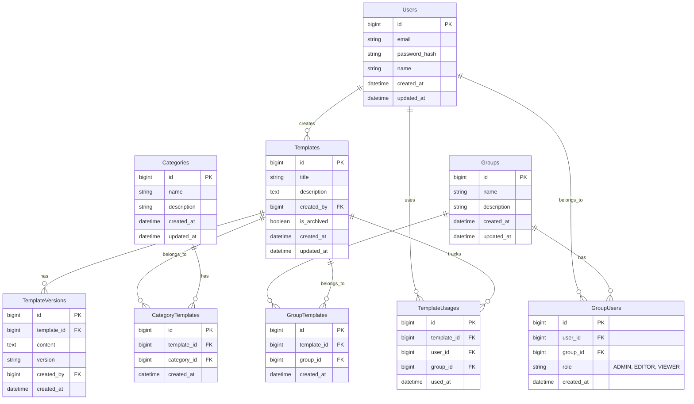

```mermaid
erDiagram
    Users ||--o{ Templates : creates
    Users ||--o{ GroupUsers : belongs_to
    Users ||--o{ TemplateUsages : uses
    Users {
        bigint id PK
        string email
        string password_hash
        string name
        datetime created_at
        datetime updated_at
    }
    
    Groups ||--o{ GroupUsers : has
    Groups ||--o{ GroupTemplates : owns
    Groups {
        bigint id PK
        string name
        string description
        datetime created_at
        datetime updated_at
    }

    GroupUsers {
        bigint id PK
        bigint user_id FK
        bigint group_id FK
        string role "ADMIN, EDITOR, VIEWER"
        datetime created_at
    }

    GroupTemplates {
        bigint id PK
        bigint template_id FK
        bigint group_id FK
        datetime created_at
    }
    
    Templates ||--o{ TemplateVersions : has
    Templates ||--o{ CategoryTemplates : belongs_to
    Templates ||--o{ GroupTemplates : belongs_to
    Templates ||--o{ TemplateUsages : tracks
    Templates {
        bigint id PK
        string title
        text description
        bigint created_by FK
        boolean is_archived
        datetime created_at
        datetime updated_at
    }

    TemplateVersions {
        bigint id PK
        bigint template_id FK
        text content
        string version
        bigint created_by FK
        datetime created_at
    }

    TemplateUsages {
        bigint id PK
        bigint template_id FK
        bigint user_id FK
        bigint group_id FK
        datetime used_at
    }

    Categories ||--o{ CategoryTemplates : has
    Categories {
        bigint id PK
        string name
        string description
        datetime created_at
        datetime updated_at
    }

    CategoryTemplates {
        bigint id PK
        bigint template_id FK
        bigint category_id FK
        datetime created_at
    }
```