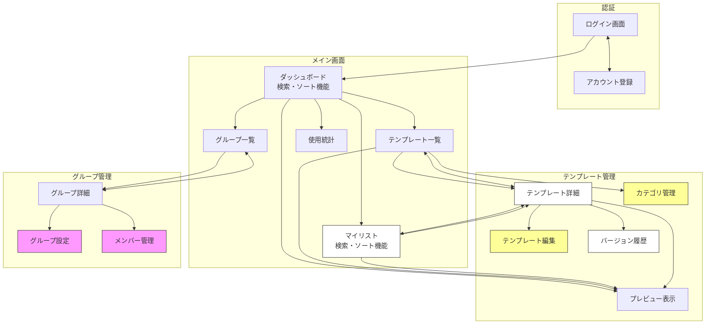

```mermaid
flowchart TD
    subgraph 認証
        Login[ログイン画面]
        Register[アカウント登録]
        Login <--> Register
    end

    subgraph メイン画面
        Dashboard[ダッシュボード\n検索・ソート機能]
        TemplateList[テンプレート一覧]
        MyList[マイリスト\n検索・ソート機能]
        GroupList[グループ一覧]
        Stats[使用統計]
    end

    subgraph テンプレート管理
        TemplateDetail[テンプレート詳細]
        TemplatePreview[プレビュー表示]
        TemplateEdit[テンプレート編集]
        VersionHistory[バージョン履歴]
        CategoryManage[カテゴリ管理]
    end

    subgraph グループ管理
        GroupDetail[グループ詳細]
        GroupEdit[グループ設定]
        MemberManage[メンバー管理]
    end

    %% 認証からメイン画面への遷移
    Login --> Dashboard

    %% ダッシュボードからの遷移
    Dashboard --> TemplateList
    Dashboard --> MyList
    Dashboard --> GroupList
    Dashboard --> Stats
    Dashboard --> TemplatePreview

    %% テンプレート関連の遷移
    TemplateList --> TemplateDetail
    TemplateList --> TemplatePreview
    MyList --> TemplateDetail
    MyList --> TemplatePreview
    TemplateDetail --> TemplateEdit
    TemplateDetail --> VersionHistory
    TemplateDetail --> TemplatePreview
    TemplateList --> CategoryManage

    %% グループ関連の遷移
    GroupList --> GroupDetail
    GroupDetail --> GroupEdit
    GroupDetail --> MemberManage

    %% 双方向の遷移を示す
    TemplateDetail <--> TemplateList
    TemplateDetail <--> MyList
    GroupDetail <--> GroupList
    
    %% 権限による制限を注記
    classDef admin fill:#f9f,stroke:#333
    classDef editor fill:#ff9,stroke:#333
    classDef viewer fill:#fff,stroke:#333
    
    class GroupEdit,MemberManage admin
    class TemplateEdit,CategoryManage editor
    class TemplateDetail,VersionHistory,MyList viewer
```