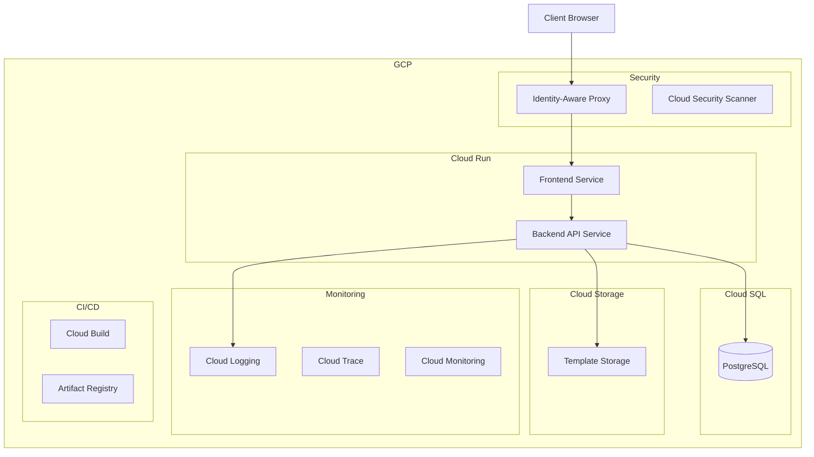

```mermaid
graph TB
    subgraph "GCP"
        subgraph "Cloud Run"
            API[Backend API Service]
            FRONT[Frontend Service]
        end
        
        subgraph "Cloud SQL"
            DB[(PostgreSQL)]
        end
        
        subgraph "Cloud Storage"
            STORAGE[Template Storage]
        end
        
        subgraph "Security"
            IAP[Identity-Aware Proxy]
            SEC[Cloud Security Scanner]
        end
        
        subgraph "Monitoring"
            LOG[Cloud Logging]
            TRACE[Cloud Trace]
            MONITOR[Cloud Monitoring]
        end
        
        subgraph "CI/CD"
            CR[Cloud Build]
            AR[Artifact Registry]
        end
    end
    
    CLIENT[Client Browser] --> IAP
    IAP --> FRONT
    FRONT --> API
    API --> DB
    API --> STORAGE
    API --> LOG
```