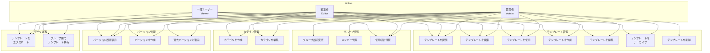

```mermaid
flowchart TB
    subgraph Actors
        VA[一般ユーザー\nViewer]
        EA[編集者\nEditor]
        AA[管理者\nAdmin]
    end

    subgraph テンプレート管理
        UC1[テンプレートを閲覧]
        UC2[テンプレートを検索]
        UC3[テンプレートを使用]
        UC4[テンプレートを作成]
        UC5[テンプレートを編集]
        UC6[テンプレートを\nアーカイブ]
        UC7[テンプレートを削除]
    end

    subgraph バージョン管理
        UC13[バージョン履歴表示]
        UC14[バージョンを作成]
        UC15[過去バージョンに復元]
    end

    subgraph グループ管理
        UC8[グループ設定変更]
        UC9[メンバー管理]
        UC10[使用統計閲覧]
    end

    subgraph カテゴリ管理
        UC11[カテゴリを作成]
        UC12[カテゴリを編集]
    end

    subgraph データ連携
        UC16[テンプレートを\nエクスポート]
        UC17[グループ間で\nテンプレート共有]
    end

    VA --> UC1
    VA --> UC2
    VA --> UC3
    VA --> UC10
    VA --> UC13
    VA --> UC16

    EA --> UC1
    EA --> UC2
    EA --> UC3
    EA --> UC4
    EA --> UC5
    EA --> UC6
    EA --> UC10
    EA --> UC11
    EA --> UC12
    EA --> UC13
    EA --> UC14
    EA --> UC15
    EA --> UC16
    EA --> UC17

    AA --> UC1
    AA --> UC2
    AA --> UC3
    AA --> UC4
    AA --> UC5
    AA --> UC6
    AA --> UC7
    AA --> UC8
    AA --> UC9
    AA --> UC10
    AA --> UC11
    AA --> UC12
    AA --> UC13
    AA --> UC14
    AA --> UC15
    AA --> UC16
    AA --> UC17
```